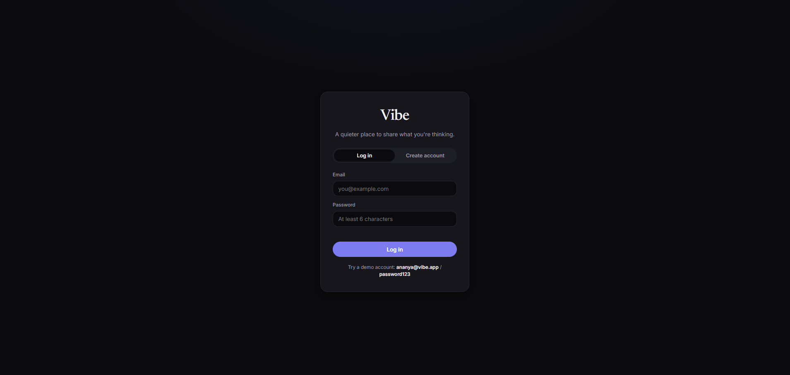
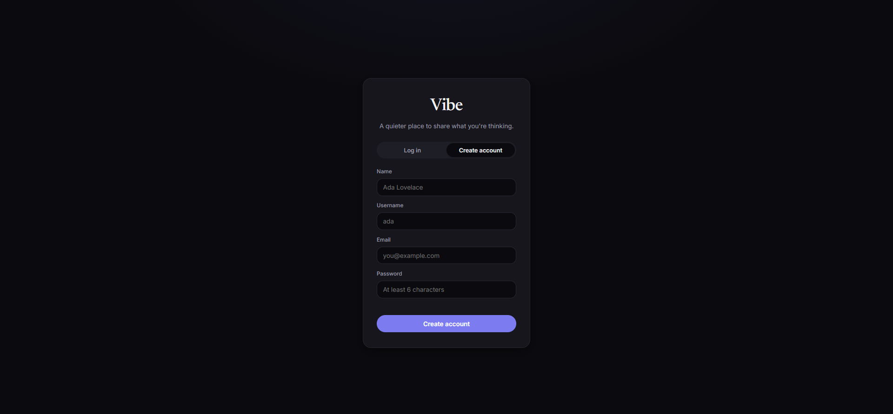
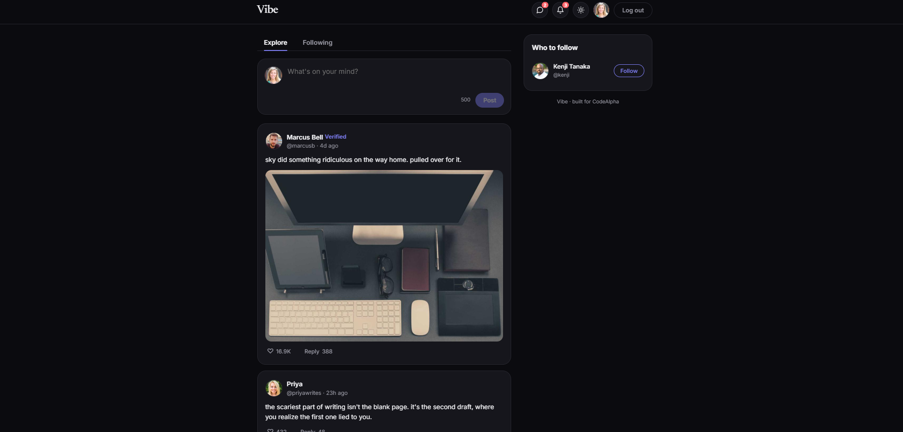
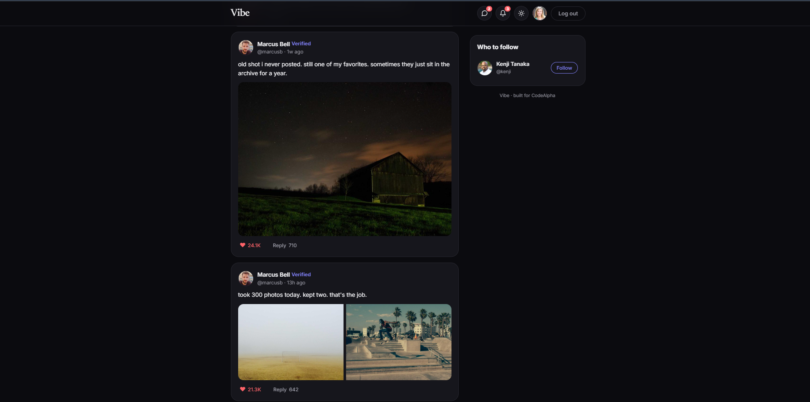
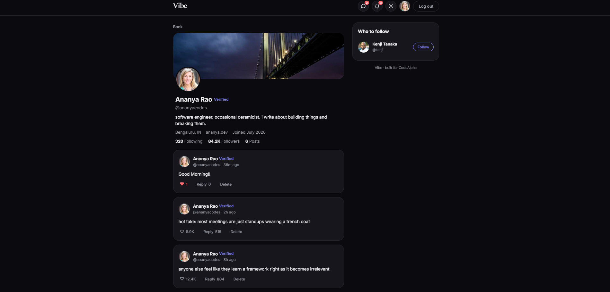
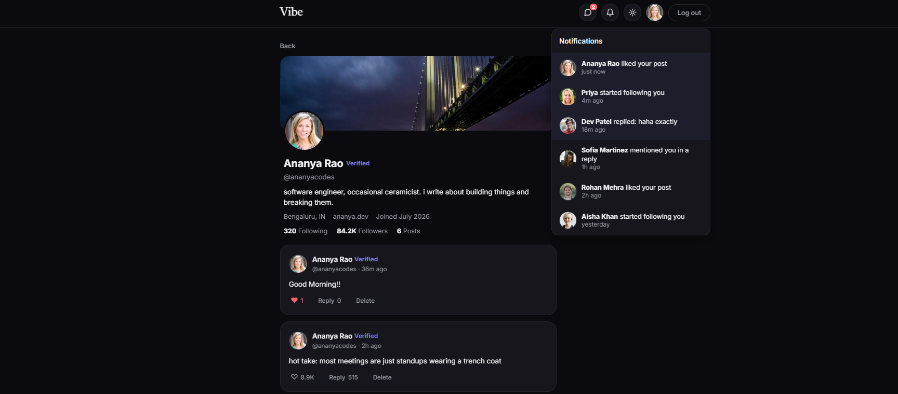
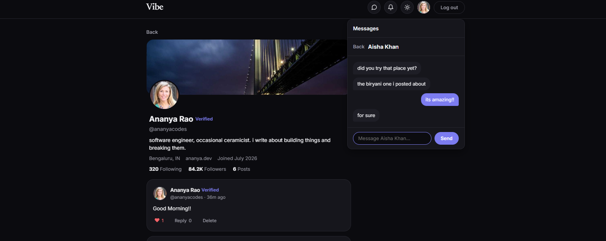

# Vibe — A Full-Stack Social Media Platform

Vibe is a full-stack social media web application built with Node.js, Express, and MongoDB, with a clean, responsive frontend in vanilla JavaScript. It features a premium, minimal design with light and dark modes, real authentication, and a live feed.

**CodeAlpha Full Stack Development Internship — Task 2 (Social Media Platform)**

## Features

- **User authentication** — register and log in with hashed passwords (bcrypt) and JWT tokens
- **User profiles** — bio, cover image, location, join date, and follower / following counts
- **Posts** — create, view, and delete posts (text and images)
- **Comments** — reply to posts in real conversations
- **Likes** — like and unlike posts
- **Follow system** — follow and unfollow other users
- **Personalized feed** — a "Following" feed (people you follow) and an "Explore" feed (everyone)
- **Notifications panel** — likes, follows, replies, and mentions
- **Messages panel** — direct-message style conversations
- **Light & dark mode** — smooth theme switching
- **Polished UI** — loading skeletons, empty states, hover effects, and smooth animations

## Tech Stack

- **Frontend:** HTML5, CSS3, JavaScript (ES6+)
- **Backend:** Node.js, Express.js
- **Database:** MongoDB with Mongoose
- **Authentication:** JWT (JSON Web Tokens) + bcrypt
- **Architecture:** RESTful API

## Screenshots

### Login


### Create Account


### Home Feed


### Feed with Image Post


### User Profile


### Notifications


### Messages


## Getting Started

### Prerequisites

- [Node.js](https://nodejs.org/) (v16 or higher)
- A [MongoDB Atlas](https://www.mongodb.com/atlas) free cluster (or local MongoDB)

### Setup

1. **Clone the repository**
   ```bash
   git clone https://github.com/aashi40802/CodeAlpha_SocialMedia.git
   cd CodeAlpha_SocialMedia
   ```

2. **Install dependencies**
   ```bash
   npm install
   ```

3. **Create a `.env` file** in the project root:
   ```
   PORT=5000
   MONGO_URI=your_mongodb_connection_string
   JWT_SECRET=your_secret_key
   JWT_EXPIRES_IN=7d
   ```

4. **Seed the database** with demo users and posts:
   ```bash
   npm run seed
   ```

5. **Start the server**
   ```bash
   npm run dev
   ```

6. **Open in the browser**
   ```
   http://localhost:5000
   ```

### Demo Login

After seeding, log in with any demo account, for example:

```
Email:    ananya@vibe.app
Password: password123
```

## API Endpoints

| Method | Endpoint | Description | Auth |
|--------|----------|-------------|------|
| POST | `/api/auth/register` | Register a new user | No |
| POST | `/api/auth/login` | Log in | No |
| GET | `/api/auth/me` | Get the current user | Yes |
| GET | `/api/users/:username` | Get a profile and counts | Yes |
| PUT | `/api/users/me` | Update your profile | Yes |
| POST | `/api/users/:username/follow` | Follow a user | Yes |
| DELETE | `/api/users/:username/follow` | Unfollow a user | Yes |
| GET | `/api/posts/feed` | Feed from people you follow | Yes |
| GET | `/api/posts/explore` | Newest posts from everyone | Yes |
| POST | `/api/posts` | Create a post | Yes |
| GET | `/api/posts/:id` | Get one post with comments | Yes |
| DELETE | `/api/posts/:id` | Delete your own post | Yes |
| POST | `/api/posts/:id/like` | Like a post | Yes |
| DELETE | `/api/posts/:id/like` | Unlike a post | Yes |
| POST | `/api/comments/:postId` | Comment on a post | Yes |
| DELETE | `/api/comments/:id` | Delete your own comment | Yes |

## Project Structure

```
CodeAlpha_SocialMedia/
├── server.js              # Express server entry point
├── config/db.js           # MongoDB connection
├── models/                # Mongoose schemas (User, Post, Comment, Like, Follow)
├── routes/                # API routes (auth, users, posts, comments)
├── middleware/auth.js     # JWT verification
├── utils/seed.js          # Demo data seeder
├── public/                # Frontend (index.html, styles.css, app.js)
└── package.json
```

## Author

**Aashi** — CodeAlpha Full Stack Development Intern

## License

This project is built for educational purposes as part of the CodeAlpha Internship Program.
